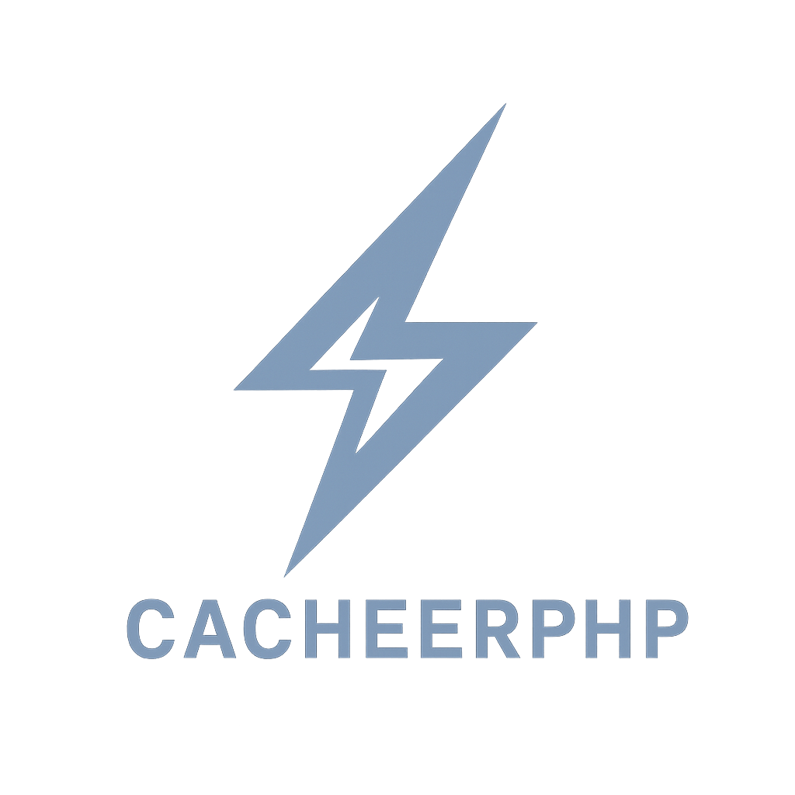

# CacheerPHP

<p align="center"><a href="https://github.com/silviooosilva/CacheerPHP"></a></p>

[](https://github.com/silviooosilva)

[](https://github.com/silviooosilva/CacheerPHP/releases)
[](https://scrutinizer-ci.com/g/silviooosilva/CacheerPHP)


CacheerPHP is a minimalist package for PHP caching. Now, in version 3.0.0, you get even more flexibility, support for multiple backends (files, database and Redis), as well as new features for monitoring, compression and encryption and a more robust API design.

---

## Features

- **Cache Storage and Retrieval:** Support for file storage, databases (MySQL, PostgreSQL, SQLite) and Redis.
- **Customizable expiration:** Set the TTL (Time To Live) of the cache precisely.
- **Cache cleaning and flushing:** Support for manual and automatic cleaning (via `flushAfter`).
- **Namespace support:** Organize your cache entries by category.
- **Customized Data Output:** Options to return data in `JSON`, `Array`, `String` or `Object`.
- **Compression and Encryption:** Reduce storage space and increase the security of cached data.
- **Cache Statistics and Monitoring:** Track hit and miss statistics and average read/write times (Coming Soon).
- **Advanced Logging:** Detailed monitoring of the operation of the caching system.

---

## Installation

CacheerPHP 3.0.0 is available via Composer. Add the following line to your **composer.json** file:

```sh
  "silviooosilva/cacheer-php": "^3.0"
```

Or run the command:

```sh
composer require silviooosilva/cacheer-php
```

## IMPORTANT WARNING!!!

Don't forget to set your environment variables in the .env.example file.

Remember that they must be set in the .env file, not in .env.example.
To do this, do the following on your command line:

```sh
cp .env.example .env 
```

## Documentation

1.  [Storing and retrieving cached data](docs/example01.md)
2.  [Customizable cache expiration](docs/example02.md)
3.  [Cache flushing and cleaning](docs/example03.md)
4.  [Namespace support for cache organization](docs/example04.md)
5.  [Automatic cleaning of the `flushAfter` cache directory](docs/example09.md)
6.  [API Response Cache](docs/example05.md)
7.  [Custom Data Output (`JSON`)](docs/example06.md)
8.  [Custom Data Output (`Array`)](docs/example07.md)
9.  [Custom Data Output (`String`)](docs/example08.md)
10. [Upgrade Guide for Version 2.0.0](docs/guide2.0.0.md)
11. [API Reference](docs/api-reference.md)
12. [API Reference - Cache Functions](docs/API-Reference/FuncoesCache/README.md)

Several practical examples are also available in the **Examples** folder in the root of the project.

## Compatibility

- PHP: 8.0 or higher.
- Database Drivers: MySQL, PostgreSQL, SQLite.
- Redis

### Tests

To run the tests, go to the root of the project and type the command:

```sh
vendor/bin/phpunit
```

<h3 align="left">Support:</h3>
<p><a href="https://buymeacoffee.com/silviooosilva"> </a></p><br><br>
